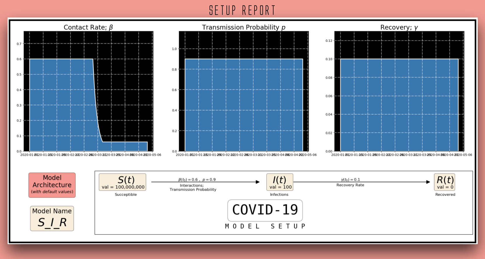

[include badges]

# PanBox
<ins>Python Package for Epidemiological Modellig and Simulation</ins>
****


## <ins>Installation</ins>
Install this package from PyPI :
```py
pip install -i https://test.pypi.org/simple/ panbox
```
## <ins>About</ins>
The constitution of this package dissimates into two segments,
- ### Simulator
- ### Models
=============


<ins>Simulator</ins>

PanSim, as seen in the first GIF, is an interactive Jupyter Notebook mwidget that can simulate the growth of an disease spread with controlable parameters for updating the the `Population dynamic` and `Epidemiology Dynamics`, such as Social Distancing Factor, Infection Radius, Fatality Rate etc while the simulation is runnign, to see the effect of a measure live.

<ins>Models</ins>

The models included in this package are based on Oridinary Differential Equations that are build for 


These models take in Time Dependent parameters into the Differential Equaation Solver, such as Contact Rate, Transmission Probability.

## <ins>Usage</ins>
```py
#Importing the Model
from panbox.panbox.models import SIRModel
sirModel = SIRModel(startdate='2020-01-01', till = "4 Months", granularity = 'Days')

#=========Initialising The Configurations=================
# General
sirModel.configParams['general.pandemic.name'] = 'COVID-19'

# Transmission
sirModel.configParams['params.sir.tpop.val'] = 1_000_000_00
sirModel.configParams['params.sir.tr.cr.val'] = 0.6
sirModel.configParams['params.sir.tr.pr.val'] = 0.9
sirModel.configParams['params.sir.tr.cr.es'] = {'2020-03-06':-0.9,
                                                '2020-07-20':+0.8}

# Infection
sirModel.configParams['params.sir.in.val'] = 100
sirModel.configParams['params.sir.rm.recov.val'] = 10/100
```

Once done with the model setup, attributes provided by the  `Model Handler` *sirModel* are

> sirModel.setup_report() # Sets up the report for you to visualise side-by-side as the parameters chage

.

> sirModel.simulate_model() # Simulate the growth of the model.


> sirModel.fit(X,y) # Fit actual data to predict the future growth.

**Releases**
- Version 0.0.1, May 3, 2020 : First Release, released SIRModel and PanSim (Simulator) for a pandemic 

[NOTE : Under Development]